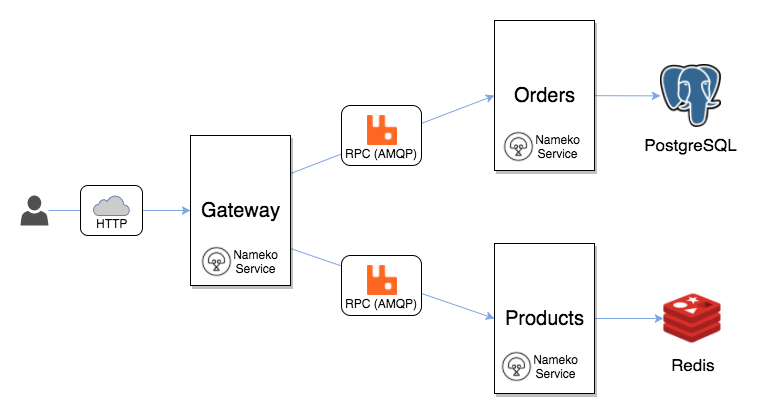

## Nameko Python
Example micro services architecture, with docker image deployments and message passing through rabbitmq.


## Prerequisites

* [Python 3](https://www.python.org/downloads/)
* [Docker](https://www.docker.com/)
* [Docker Compose](https://docs.docker.com/compose/)

## Overview

### Repository structure
When developing Nameko services you have the freedom to organize your repo structure any way you want.

For this example we placed 3 Nameko services: `Products`, `Orders` and `Gateway` in one repository.

While possible, this is not necessarily the best practice. Aim to apply Domain Driven Design concepts and try to place only services that belong to the same bounded context in one repository e.g., Product (main service responsible for serving products) and Product Indexer (a service responsible for listening for product change events and indexing product data within search database).

### Services



#### Products Service

Responsible for storing and managing product information and exposing RPC Api that can be consumed by other services. This service is using Redis as it's data store. Example includes implementation of Nameko's [DependencyProvider](https://nameko.readthedocs.io/en/stable/key_concepts.html#dependency-injection) `Storage` which is used for talking to Redis.

#### Orders Service

Responsible for storing and managing orders information and exposing RPC Api that can be consumed by other services.

This service is using PostgreSQL database to persist order information.
- [nameko-sqlalchemy](https://pypi.python.org/pypi/nameko-sqlalchemy)  dependency is used to expose [SQLAlchemy](http://www.sqlalchemy.org/) session to the service class.
- [Alembic](https://pypi.python.org/pypi/alembic) is used for database migrations.

#### Gateway Service

Is a service exposing HTTP Api to be used by external clients e.g., Web and Mobile Apps. It coordinates all incoming requests and composes responses based on data from underlying domain services.

[Marshmallow](https://pypi.python.org/pypi/marshmallow) is used for validating, serializing and deserializing complex Python objects to JSON and vice versa in all services.

## Running examples

Quickest way to try out examples is to run them with Docker Compose

`$ docker-compose up`

Docker images for [RabbitMQ](https://hub.docker.com/_/rabbitmq/), [PostgreSQL](https://hub.docker.com/_/postgres/) and [Redis](https://hub.docker.com/_/redis/) will be automatically downloaded and their containers linked to example service containers.

When you see `Connected to amqp:...` it means services are up and running.

Gateway service with HTTP Api is listening on port 8003 and these endpoitns are available to play with:

#### Create Product

```sh
$ curl -XPOST -d '{"id": "the_odyssey", "title": "The Odyssey", "passenger_capacity": 101, "maximum_speed": 5, "in_stock": 10}' 'http://localhost:8003/products'
```

#### Get Product

```sh
$ curl 'http://localhost:8003/products/the_odyssey'

{
  "id": "the_odyssey",
  "title": "The Odyssey",
  "passenger_capacity": 101,
  "maximum_speed": 5,
  "in_stock": 10
}
```


## Running tests

Ensure RabbitMQ, PostgreSQL and Redis are running and `config.yaml` files for each service are configured correctly.

`$ make coverage`
`$ docker rm $(docker ps -qa --filter "status=exited")`
`$ docker rmi $(docker images -q -f dangling=true)`
